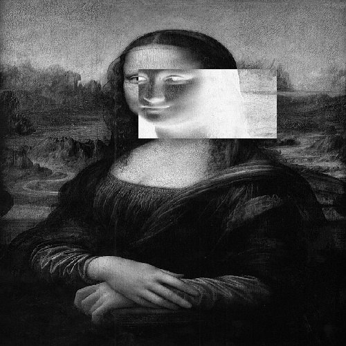
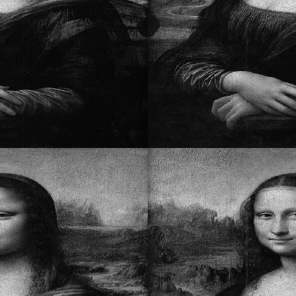
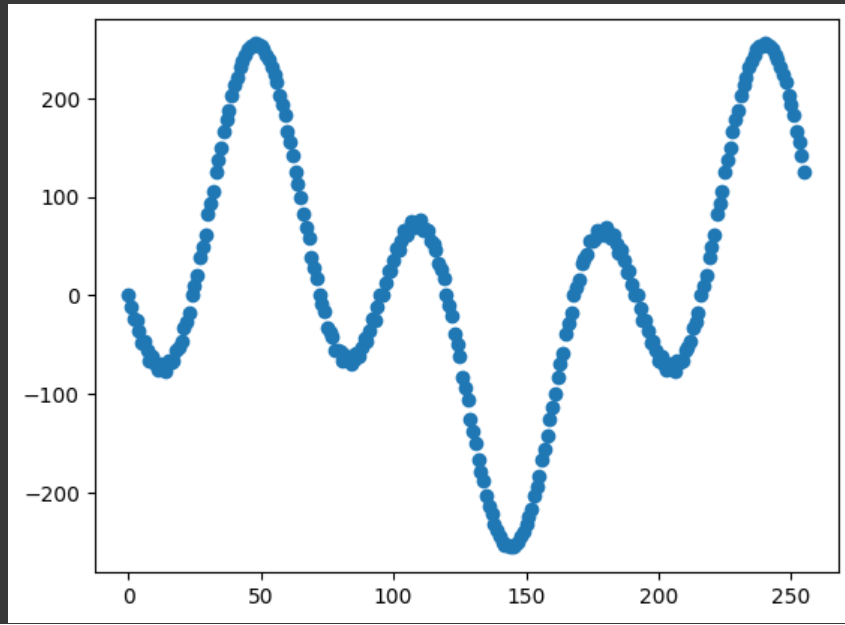
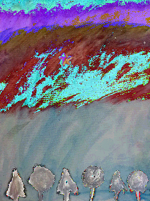
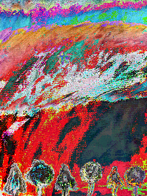
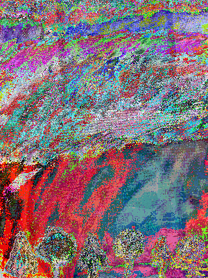
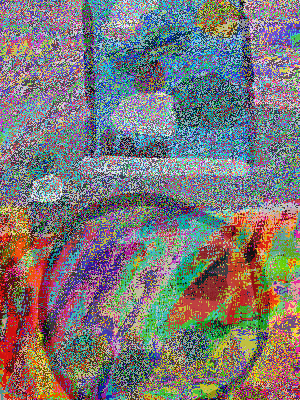
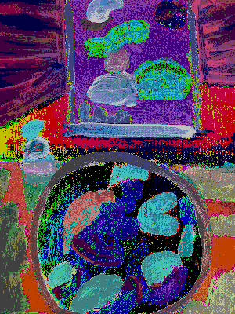
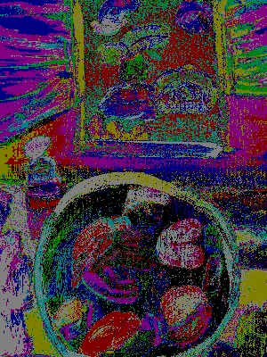

= Atividades de  processamento digital de imagens
:source-highlighter: highlightjs
:source-language: cpp
:source-language: python
Nome: Marcos Matsunaga

questões feitas: 

cap 2 <<Exercício 2.2>> <<Exercício 2.3>> 

cap5 <<Exercício 5.2>>

cap10 <<Exercício 10.3>>

cap11 <<Exercício 11.2>> <<Exercício 11.3>>

cap12 <<Exercício 12.2>> <<Exercício 12.3>>

cap14 <<Exercício 14.2>>

== Exercício 2.2

Nessa primeira atividade foi pedido para que  criasse um programa que recebe duas coordenadas e  retorna uma imagem com o ponto dessa duas coordenadas em negativo.

.código region.cpp
[source,cpp]
----
#include <iostream>
#include <opencv2/opencv.hpp>

int main(int, char**) {
    cv::Mat image;
   
    //definindo o ponto1 e ponto 2
    int ponto1x;
    int ponto1y;

    std::cout << "defina o ponto1 x" << std::endl;
    std::cin >> ponto1x;
    std::cout << "defina o ponto1 y" << std::endl;
    std::cin >> ponto1y;

    int ponto2x;
    int ponto2y;

    std::cout << "defina o ponto2 x" << std::endl;
    std::cin >> ponto2x;
    std::cout << "defina o ponto2 y" << std::endl;
    std::cin >> ponto2y;

    image = cv::imread("Mona_Lisa.jpg", cv::IMREAD_GRAYSCALE);
    
    if (!image.data) std::cout << "nao abriu monalisa.png" << std::endl;
    cv::resize(image, image, { 500,500 }, 0, 0, cv::INTER_NEAREST);
    cv::namedWindow("janela", cv::WINDOW_AUTOSIZE);
    
    for (int i = ponto1x; i < ponto2x; i++) {
        for (int j = ponto1y; j < ponto2y; j++) {
            image.at<uchar>(i, j) = 255 - image.at<uchar>(i, j);
        }
    }
    cv::imwrite("monalisapinta.jpg", image);

    cv::imshow("janela", image);
    cv::waitKey();

   
    return 0;
}
----
As entradas escolhidas foram ponto 1 (100,200),  ponto 2 (200,400) e  imagem foi utilizada no exercício foi a  Mona_Lisa.jpg a saída gerada  foi a monalisapinta.jpg.

.Imagem de entrada Mona_Lisa.jpg. 
image::Mona_Lisa.jpg[teste,200,100,float="center",align="center"]

.Imagem de saída monalisapinta.jpg. 

=== 2.2.1 Descrição do programa regions.cpp
.código region.cpp
[source,cpp]
----

    int ponto1x;
    int ponto1y;

    std::cout << "defina o ponto1 x" << std::endl;
    std::cin >> ponto1x;
    std::cout << "defina o ponto1 y" << std::endl;
    std::cin >> ponto1y;

    int ponto2x;
    int ponto2y;

    std::cout << "defina o ponto2 x" << std::endl;
    std::cin >> ponto2x;
    std::cout << "defina o ponto2 y" << std::endl;
    std::cin >> ponto2y;

----
Nessa primeira parte do código basicamente seria onde é definido os pontos de entrada, em que ponto1x e ponto1y seria a coordena de uma das vértice do retângulo e ponto2x e ponto2y o outro pronto da vértice. 

[source,cpp]
----
    image = cv::imread("Mona_Lisa.jpg", cv::IMREAD_GRAYSCALE);
    
    if (!image.data) std::cout << "nao abriu monalisa.png" << std::endl;
    cv::resize(image, image, { 500,500 }, 0, 0, cv::INTER_NEAREST);
    cv::namedWindow("janela", cv::WINDOW_AUTOSIZE);
----
Após definir os pontos de entrada fazemos o carregamento da imagem  em ``image = cv::imread("Mona_Lisa.jpg", cv::IMREAD_GRAYSCALE);``  e definimos que possui a tonalidade em tons de cinza, o “if” seria apenas para confirmar que a imagem foi carregada , utilizamos o  ``cv::resize`` para reduzir a imagem para 500x500 e por último utilizamos a função ``cv::namedWindow`` para definia janela que exibirá o iamgem.
 
[source,cpp]
----
    for (int i = ponto1x; i < ponto2x; i++) {
        for (int j = ponto1y; j < ponto2y; j++) {
            image.at<uchar>(i, j) = 255 - image.at<uchar>(i, j);
        }
    }
    cv::imwrite("monalisapinta.jpg", image);

    cv::imshow("janela", image);
    cv::waitKey();
----
Nesse “for” ocorre a transformação de pixels para negativo em que com os ponto de entrada percorremos a imagem e com a operação `` image.at<uchar>(i, j) = 255 - image.at<uchar>(i, j);`` mudamos os  pixels da posição i e j para negativo. Por fim acontece o salvamento da imagem em ``cv::imwrite("monalisapinta.jpg", image);`` e mostramos em tela com ``cv::imshow("janela", image);``.

== Exercício 2.3
Essa questão pedia para que realizassem a troca de quadrante diagonal da imagem, foi utilizando a mesma imagem da Mona_Lisa.jpg da atividade anterior.

.código trocaregion.cpp
[source,cpp]
----
#include <iostream>
#include <opencv2/opencv.hpp>

int main(int, char**) {
    cv::Mat image;
    cv::Mat image2;
   

    image = cv::imread("Mona_Lisa.jpg", cv::IMREAD_GRAYSCALE);
    

    
    if (!image.data) std::cout << "nao abriu bolhas.png" << std::endl;
    cv::resize(image, image, { 500,500 }, 0, 0, cv::INTER_NEAREST);
    image2 = image.clone();
    cv::namedWindow("janela", cv::WINDOW_AUTOSIZE);
    cv::namedWindow("janela2", cv::WINDOW_AUTOSIZE);
    for (int i = 0; i < image.rows/2; i++) {
        for (int j = 0; j < image.cols/2;j++) {
            image2.at<uchar>(i, j) = image.at<uchar>(image.rows/2+i, image.cols / 2+ j);
        }

    }
    int aux = 0;
    for (int i = 0; i < image.rows/2; i++) {
        for (int j = image.cols/2; j < image.cols; j++) {
            image2.at<uchar>(i, j) = image.at<uchar>(image.rows / 2 + i, aux);
            aux++;
            
        }
        aux = 0;
    }

    aux = 0;
    for (int i = image.rows / 2; i < image.rows; i++) {
        for (int j = 0; j < image.cols/2; j++) {
            image2.at<uchar>(i, j) = image.at<uchar>(aux, image.cols / 2+ j);
        }
        aux++;
    }

    aux = 0;
    int aux2 = 0;
    for (int i = image.rows / 2; i < image.rows; i++) {
        for (int j = image.cols / 2; j < image.cols; j++) {
            image2.at<uchar>(i, j) = image.at<uchar>(aux, aux2);
            aux2++;
        }
        aux++;
        aux2 = 0;
    }
    cv::imwrite("sainver.jpg", image2);
    cv::imshow("janela", image);
    cv::imshow("janela2", image2);
    cv::waitKey();

   
    return 0;
}
----
Imagem de saída:

.Imagem da saída do programa troca regiões. 

=== 2.3.1 Descrição do programa trocaregioes.cpp
.código trocaregioes.cpp
[source,cpp]
----
    for (int i = 0; i < image.rows/2; i++) {
        for (int j = 0; j < image.cols/2;j++) {
            image2.at<uchar>(i, j) = image.at<uchar>(image.rows/2+i, image.cols / 2+ j);
        }

    }
    int aux = 0;
    for (int i = 0; i < image.rows/2; i++) {
        for (int j = image.cols/2; j < image.cols; j++) {
            image2.at<uchar>(i, j) = image.at<uchar>(image.rows / 2 + i, aux);
            aux++;
            
        }
        aux = 0;
    }

    aux = 0;
    for (int i = image.rows / 2; i < image.rows; i++) {
        for (int j = 0; j < image.cols/2; j++) {
            image2.at<uchar>(i, j) = image.at<uchar>(aux, image.cols / 2+ j);
        }
        aux++;
    }

    aux = 0;
    int aux2 = 0;
    for (int i = image.rows / 2; i < image.rows; i++) {
        for (int j = image.cols / 2; j < image.cols; j++) {
            image2.at<uchar>(i, j) = image.at<uchar>(aux, aux2);
            aux2++;
        }
----
Para solução desse problema basicamente foi feita uma Mat auxiliar chamada ``image2``   em que ele guarda os quadrantes diagonais oposto da imagem vale ressaltar que a imagem foi convertida para para tons de cinza. O maior trabalho do programa está nos 4 “for” em que percorrem cada quadrante da`` image1``  e colocar no quadrante oposto da ``imagem2`` isso pode ser visto em ``image2.at<uchar>(i, j) = image.at<uchar>(image.rows/2+i, image.cols / 2+ j);``.

== Exercício 5.2
analisar um linha do formato png e yml.

.código filestorage.cpp
[source,cpp]
----
#include <iostream>
#include <opencv2/opencv.hpp>
#include <sstream>
#include <string>
#include <math.h>
#include <fstream>

float M_PI = 3.141592;
int SIDE = 256;
int PERIODOS = 4;

int main(int argc, char** argv) {
    std::stringstream ss_img, ss_yml;
    cv::Mat image;
    cv::Mat image2;
    cv::Mat image3;
    std::ofstream file;

    ss_yml << "senoide-" << SIDE << ".yml";
    image = cv::Mat::zeros(SIDE, SIDE, CV_32FC1);

    cv::FileStorage fs(ss_yml.str(), cv::FileStorage::WRITE);

    for (int i = 0; i < SIDE; i++) {
        for (int j = 0; j < SIDE; j++) {
            image.at<float>(i, j) = 127 * sin(2 * M_PI * PERIODOS * j / SIDE) + 128;
        }
    }

    fs << "mat" << image;
    fs.release();

    cv::normalize(image, image, 0, 255, cv::NORM_MINMAX);
    image.convertTo(image, CV_8U);
    ss_img << "senoide-" << SIDE << ".png";
    cv::imwrite(ss_img.str(), image);

  

    cv::imshow("image", image);

    image3 = imread("senoide-256.png", cv::IMREAD_COLOR);
    if (!image3.data) {
        std::cout << "imagem nao carregou corretamente\n";
        return(-1);
    }
    cv::imshow("image3", image3);
    file.open("image3.txt");
    for (int i = 0; i < image3.cols; i++) {
        file << (float)(image3.at<uchar>(image3.rows / 2, i)) << "\n";
    }
    file.close();

    fs.open(ss_yml.str(), cv::FileStorage::READ);
    fs["mat"] >> image2;
    cv::normalize(image2, image2, 0, 255, cv::NORM_MINMAX);
    image2.convertTo(image2, CV_8U);
    cv::imshow("image2", image2);

    //cv::waitKey();
    file.open("image2.txt");
    for (int i = 0; i < image2.cols; i++) {
        file << (float)(image2.at<uchar>(image2.rows / 2, i)) << "\n";
    }
    file.close();
    cv::waitKey();

    return 0;
}
----
.código plotgrafico.py
[source,python]
----
import matplotlib.pyplot as plt
import numpy as np
file = open("image2.txt", "r")

lista = []
while True:
  content=file.readline()
  if not content:
  	break
  #print(content)
  lista.append(content)

file.close()
file = open("image3.txt", "r")

lista2 = []
while True:
  content2=file.readline()
  if not content2:
  	break
  #print(content)
  lista2.append(content2)

file.close()
aux = []
diference = []
for i in range(len(lista)):
  diference.append(int(lista2[i]) - int(lista[i]))

for i in range(len(lista)):
  aux.append(i)

plt.plot(aux, diference, 'o')
plt.show()
----

No final foi gerado o seguinte gráfico

.Gráfico da diferença de pixels.

Este gráfico apresenta que houve uma diferença da linha nas cores do pixels mesmo sendo imagens relativamente iguais isso se deve provavelmente pelo formato png ser diferente do yml.

[source,cpp]
----
file.open("image3.txt");
    for (int i = 0; i < image3.cols; i++) {
        file << (float)(image3.at<uchar>(image3.rows / 2, i)) << "\n";
    }
    file.close();
----
=== 2.3.1 Descrição do programa filestorage.cpp
A maior diferença entre esse programa e o original seria nessa parte em que salvo os pixels da linha em um arquivo chamando “image3.txt” e “image2.txt” que seriam a imagem em formato yml e png respectivamente. Com esses dois txt foi analisado em python para gerar o gráfico.  

== Exercício 10.3

Esta atividade foi pedido para encontrar uma imagem secreta utilizando esteganografia reversa. 
.código  bitplanes.cpp
[source,cpp]
----
#include <iostream>
#include <opencv2/opencv.hpp>

int main(int argc, char** argv) {
    cv::Mat  imagemEscondida, imagemFinal, imagemPortadora;
    cv::Vec3b  valEscondida, valFinal, valPortadora;
    int nbits = 7;
    
    imagemEscondida = cv::imread("desafio-esteganografia.png", cv::IMREAD_COLOR);
    if (imagemEscondida.empty()) {
        std::cout << "imagem nao carregou corretamente" << std::endl;
        return (-1);
    }
    imagemPortadora = cv::imread("desafio-esteganografia.png", cv::IMREAD_COLOR);
    if (imagemEscondida.empty()) {
        std::cout << "imagem nao carregou corretamente" << std::endl;
        return (-1);
    }
    imagemFinal = imagemPortadora.clone();
   
    for (int i = 0; i < imagemEscondida.rows; i++) {
        for (int j = 0; j < imagemEscondida.cols; j++) {
            valEscondida = imagemEscondida.at<cv::Vec3b>(i, j);
            
            valEscondida[0] = valEscondida[0] << (8 - nbits);
            valEscondida[1] = valEscondida[1] << (8 - nbits);
            valEscondida[2] = valEscondida[2] << (8 - nbits);
            
            valFinal[0] = valEscondida[0];
            valFinal[1] = valEscondida[1];
            valFinal[2] = valEscondida[2];
            imagemFinal.at<cv::Vec3b>(i, j) = valFinal;
            //std::cout << "teste";

  
        }
    }
    imwrite("recuperada7.png", imagemFinal);
    return 0;
    
}
----
Imagem de entrada e saída:

.Imagem original
image::desafio-esteganografia.png[teste,300,500,float="center",align="center"]

.Imagem recuperada com 1 bit   

.Imagem recuperada com 2 bit   

.Imagem recuperada com 3 bit   

.Imagem recuperada com 4bit   

.Imagem recuperada com 5 bit   
image::recuperada3.png[teste,300,500,float="center",align="center"]

.Imagem recuperada com 6 bit   

.Imagem recuperada com 7 bit   

Analisando as imagens o que tem 5 bits recuperados aparenta ser a melhor que seria os 5 bit menos significativos.

=== 2.2.1 Descrição do programa bitplanes.cpp
[source,cpp]
----
    for (int i = 0; i < imagemEscondida.rows; i++) {
        for (int j = 0; j < imagemEscondida.cols; j++) {
            valEscondida = imagemEscondida.at<cv::Vec3b>(i, j);
            
            valEscondida[0] = valEscondida[0] << (8 - nbits);
            valEscondida[1] = valEscondida[1] << (8 - nbits);
            valEscondida[2] = valEscondida[2] << (8 - nbits);
            
            valFinal[0] = valEscondida[0];
            valFinal[1] = valEscondida[1];
            valFinal[2] = valEscondida[2];
            imagemFinal.at<cv::Vec3b>(i, j) = valFinal;
            //std::cout << "teste";
        }
    }
    imwrite("recuperada7.png", imagemFinal);
----
O segredo para resolução está na operação << que deslocam os bit menos significativos para frente fazendo que a imagem se torne mais importante que a imagem que a cobre. Então neste “for” ocorre a  ``valEscondida[2] = valEscondida[2] << (8 - nbits);`` em que empurra os bits em 8 -nbits.

== Exercício 11.2
A atividade pede para resolver o problema quando chegar a 255 objetos contados  que passa do limite de bit e bug do programa.

.código labeling.cpp
[source,cpp]
----
include <iostream>
#include <opencv2/opencv.hpp>

using namespace cv;

int main(int argc, char** argv) {
  cv::Mat image, realce;
  int width, height;
  int nobjects;

  cv::Point p;
  image = cv::imread(argv[1], cv::IMREAD_GRAYSCALE);

  if (!image.data) {
    std::cout << "imagem nao carregou corretamente\n";
    return (-1);
  }

  width = image.cols;
  height = image.rows;
  std::cout << width << "x" << height << std::endl;

  p.x = 0;
  p.y = 0;

  // busca objetos presentes
  nobjects = 0;
  cor = 200;
  for (int i = 0; i < height; i++) {
    for (int j = 0; j < width; j++) {
      if (image.at<uchar>(i, j) == 255) {
        // achou um objeto
        nobjects++;
        // para o floodfill as coordenadas
        // x e y são trocadas.
        p.x = j;
        p.y = i;
        cv::floodFill(image, p, cor);
      }
    }
  }
  std::cout << "a figura tem " << nobjects << " bolhas\n";
  cv::imshow("image", image);
  cv::imwrite("labeling.png", image);
  cv::waitKey();
  return 0;
}
----

=== 11.2.1 Descrição do programa labeling.cpp
[source,cpp]
----
cor = 200;
  for (int i = 0; i < height; i++) {
    for (int j = 0; j < width; j++) {
      if (image.at<uchar>(i, j) == 255) {
        // achou um objeto
        nobjects++;
        // para o floodfill as coordenadas
        // x e y são trocadas.
        p.x = j;
        p.y = i;
        cv::floodFill(image, p, cor);
      }
    }
  }
----
Basicamente o necessário para corrigir isso seria trocar ``nobjects`` no ``cv::floodFill(image, p, nobjects);``  por um variável constante necessário caso foi escolhido uma variável chamada cor = 200;.

== Exercício 11.3
Agora a atividade pede que seja possível contar o número de objetos com buracos e  sem buracos separadamente e de bônus retirar os objetos que tocam as bordas.

.código labeling2.cpp
[source,cpp]
----
#include <iostream>
#include <opencv2/opencv.hpp>

using namespace cv;

int main(int argc, char** argv) {
    cv::Mat image, realce;
    int width, height;
    int nobjects;
    int cor;

    cv::Point p;
    image = cv::imread("bolhas.png", cv::IMREAD_GRAYSCALE);
    //image = cv::imread(argv[1], cv::IMREAD_GRAYSCALE);

    if (!image.data) {
        std::cout << "imagem nao carregou corretamente\n";
        return (-1);
    }

    width = image.cols;
    height = image.rows;
    std::cout << width << "x" << height << std::endl;

    p.x = 0;
    p.y = 0;

    // busca objetos presentes
    nobjects = 0;
    cor = 200;

    for (int i = 0; i < height; i++) {
        for (int j = 0; j < width; j++) {
            if (image.at<uchar>(i, j) == 255) {
                // achou um objeto
                nobjects++;
                // para o floodfill as coordenadas
                // x e y são trocadas.
                p.x = j;
                p.y = i;
                // preenche o objeto com o contador
                cv::floodFill(image, p, cor);
            }
        }
    }
    //std::cout << "a figura tem " << nobjects << " bolhas\n";
    //cv::imshow("image", image);
    //cv::imwrite("labeling.png", image);
    for (int i = 0; i < height;i++) {
        if (image.at<uchar>(i, 0) == cor) {
            p.x = 1;
            p.y = i;
            cv::floodFill(image, p, 0);
        
        }
        if (image.at<uchar>(i, width-1) == cor) {
            p.x = width-1;
            p.y = i;
            cv::floodFill(image, p, 0);

        }
    }
    for (int i = 0; i < width;i++) {
        if (image.at<uchar>(0, i) == cor) {
            p.x = i;
            p.y = 0;
            cv::floodFill(image, p, 0);

        }
        if (image.at<uchar>(height - 1, i) == cor) {
            p.x = i;
            p.y = height - 1;
            cv::floodFill(image, p, 0);

        }
    }
    int Comburaco = 0;
    int Semburaco = 0;
    p.x = 0;
    p.y = 0;
    cv::floodFill(image, p, 255);
    cv::imwrite("labelingsemobjetosnaborda.png", image);
    for (int i = 0; i < height; i++) {
        for (int j = 0; j < width; j++) {
            if (image.at<uchar>(i, j) == 0) {
                if (image.at<uchar>(i, j - 1) == cor) {
                    Comburaco++;
                    p.x = j;
                    p.y = i;
                    cv::floodFill(image, p, 255);
                    p.x = j-1;
                    p.y = i;
                    cv::floodFill(image, p, 255);
                }
                p.x = j;
                p.y = i;
                cv::floodFill(image, p, 255);
            }
        }
    }
    cv::imwrite("labelingburacosconsumidos.png", image);
    std::cout << "a figura tem " << Comburaco<< " bolhas com buracos\n";
  
    for (int i = 0; i < height; i++) {
        for (int j = 0; j < width; j++) {
            if (image.at<uchar>(i, j) == cor) {
                Semburaco++;
                p.x = j;
                p.y = i;
                cv::floodFill(image, p, 255);
            }
        }
    }
    std::cout << "a figura tem " << Semburaco << " bolhas sem buracos\n";
    std::cout << "teste" << nobjects << " bolhas\n";
    cv::imshow("imageteste", image);
    cv::imwrite("labelingfinal.png", image);
    cv::waitKey();
    return 0;
}
----
=== 11.3.1 Descrição do programa labeling.2cpp
[source,cpp]
----
for (int i = 0; i < height;i++) {
    if (image.at<uchar>(i, 0) == cor) {
        p.x = 1;
        p.y = i;
        cv::floodFill(image, p, 0);
    
    }
    if (image.at<uchar>(i, width-1) == cor) {
        p.x = width-1;
        p.y = i;
        cv::floodFill(image, p, 0);

    }
}
for (int i = 0; i < width;i++) {
    if (image.at<uchar>(0, i) == cor) {
        p.x = i;
        p.y = 0;
        cv::floodFill(image, p, 0);

    }
    if (image.at<uchar>(height - 1, i) == cor) {
        p.x = i;
        p.y = height - 1;
        cv::floodFill(image, p, 0);

    }
}
----
Nessa primeira parte fazemos 2 “for” para percorrer a imagem e  realizar a retirada de objetos que tocam a parede sendo uma para as bordas direita e esquerda e o outro para as bordas acima e embaixo.
[source,cpp]
----
p.x = 0;
p.y = 0;
cv::floodFill(image, p, 255);
cv::imwrite("labelingsemobjetosnaborda.png", image);
for (int i = 0; i < height; i++) {
    for (int j = 0; j < width; j++) {
        if (image.at<uchar>(i, j) == 0) {
            // achou um objeto
            if (image.at<uchar>(i, j - 1) == cor) {
                Comburaco++;
                p.x = j;
                p.y = i;
                cv::floodFill(image, p, 255);
                p.x = j-1;
                p.y = i;
                cv::floodFill(image, p, 255);
            }
            p.x = j;
            p.y = i;
            cv::floodFill(image, p, 255);
        }
    }
}
----
Após retirar os objetos da borda aplicamos fazemos um ``cv::floodFill(image, p, 255);`` para pintar o fundo preto da imagem em branco para destacar os buracos como preto, depois entramos em um “for” para percorrer a imagem e encontrar os buracos, o primeiro “if” analisa se encontrou um buraco (``if (image.at<uchar>(i, j) == 0)``), o segundo “if” confirma que estamos em um buraco e não em uma mancha preta resquício se o objeto tiver mais de dois buracos(``if (image.at<uchar>(i, j - 1) == cor) ``) com isso realiza a contagem de buraco e pinta o objeto e o buraco de branco, por fim aplicamos um floodfill caso seja um falso buraco.
[source,cpp]
----
for (int i = 0; i < height; i++) {
    for (int j = 0; j < width; j++) {
        if (image.at<uchar>(i, j) == cor) {
            // achou um objeto
            Semburaco++;
            // para o floodfill as coordenadas
            // x e y são trocadas.
            p.x = j;
            p.y = i;
            // preenche o objeto com o contador
            cv::floodFill(image, p, 255);
        }
    }
}
----
Nesse último for realizamos a contagem dos objetos sem buraco e pintamos de branco para no final o resultado ser uma imagem em branco. 

== Exercício 12.2
Essa atividade será realizada a equalização sobre um video. 

.código histogram.cpp
[source,cpp]
----
#include <iostream>
#include <opencv2/opencv.hpp>
#include "camera.hpp"

int main(int argc, char** argv) {
    cv::Mat image;
    int width, height;
    int camera;
    cv::VideoCapture cap;
    std::vector<cv::Mat> planes;
    cv::Mat histR, histG, histB;
    int nbins = 64;
    float range[] = { 0, 255 };
    const float* histrange = { range };
    bool uniform = true;
    bool acummulate = false;
    int key;
    cv::Mat equa;

    camera = cameraEnumerator();
    cap.open(camera);

    if (!cap.isOpened()) {
        std::cout << "cameras indisponiveis";
        return -1;
    }

    cap.set(cv::CAP_PROP_FRAME_WIDTH, 640);
    cap.set(cv::CAP_PROP_FRAME_HEIGHT, 480);
    width = cap.get(cv::CAP_PROP_FRAME_WIDTH);
    height = cap.get(cv::CAP_PROP_FRAME_HEIGHT);

  

    
    cv::Size frameSize(static_cast<int>(width), static_cast<int>(height));
    //int type = cv::VideoWriter_fourcc(*'XVID')
    cv::VideoWriter out("output.avi", cv::VideoWriter::fourcc('M', 'J', 'P', 'G'), 10, frameSize, false);
    cv::VideoWriter out2("output2.avi", cv::VideoWriter::fourcc('M', 'J', 'P', 'G'), 10, frameSize, false);
    int aux = 0;
    while (aux<100) {
        cap >> image;
        cv::cvtColor(image, image, cv::COLOR_BGR2GRAY);
        cv::Mat saida;
        cv::equalizeHist(image,saida);
        out.write(saida);
        out2.write(image);
        cv::imshow("image", saida);
        //out.write(image);
        key = cv::waitKey(30);
        aux++;
        if (cv::waitKey(30) >= 0) break;
    }
    return 0;
}
----
o resultados são apresentado a seguir:

.vídeo sem equalização 

video::DcrISIhZTN8[youtube,width=640,height=480,align=center]

.vídeo com equalização 

video::AV5H1j7HULQ[youtube,width=640,height=480,align=center]

=== 12.2.1 Descrição do programa histogram.2cpp
[source,cpp]
----
 while (aux<100) {
     cap >> image;
     cv::cvtColor(image, image, cv::COLOR_BGR2GRAY);
     cv::Mat saida;
     cv::equalizeHist(image,saida);
     out.write(saida);
     out2.write(image);
     cv::imshow("image", saida);
     //out.write(image);
     key = cv::waitKey(30);
     aux++;
     if (cv::waitKey(30) >= 0) break;
 }
----
Basicamente para o opencv já possui um função que realiza equalização então no while e capturado as 100 primeira imagens e nela é aplicada ``cv::equalizeHist(image,saida);`` e então é salvo e criado o video.

== Exercício 12.3
Essa atividade é para criar o sensor de movimento com a variação do histograma.

.código motiondetector.cpp
[source,cpp]
----
#include <iostream>
#include <opencv2/opencv.hpp>
#include "camera.hpp"
#include <cmath>
#include <windows.h>

int main(int argc, char** argv) {
    cv::Mat image;
    int width, height;
    int camera;
    cv::VideoCapture cap;
    std::vector<cv::Mat> planes;
    cv::Mat histR, histG, histB, histRpas;
    int nbins = 64;
    float range[] = { 0, 255 };
    const float* histrange = { range };
    bool uniform = true;
    bool acummulate = false;
    int key;

    camera = cameraEnumerator();
    cap.open(camera);

    if (!cap.isOpened()) {
        std::cout << "cameras indisponiveis";
        return -1;
    }

    cap.set(cv::CAP_PROP_FRAME_WIDTH, 640);
    cap.set(cv::CAP_PROP_FRAME_HEIGHT, 480);
    width = cap.get(cv::CAP_PROP_FRAME_WIDTH);
    height = cap.get(cv::CAP_PROP_FRAME_HEIGHT);

    std::cout << "largura = " << width << std::endl;
    std::cout << "altura  = " << height << std::endl;

    int histw = nbins, histh = nbins / 2;
    cv::Mat histImgR(histh, histw, CV_8UC3, cv::Scalar(0, 0, 0));
    cv::Mat histImgG(histh, histw, CV_8UC3, cv::Scalar(0, 0, 0));
    cv::Mat histImgB(histh, histw, CV_8UC3, cv::Scalar(0, 0, 0));
    int aux = 1;
    int diferenca;
    while (1) {
        cap >> image;
        cv::split(image, planes);
        cv::calcHist(&planes[0], 1, 0, cv::Mat(), histB, 1,
            &nbins, &histrange,
            uniform, acummulate);
        cv::calcHist(&planes[1], 1, 0, cv::Mat(), histG, 1,
            &nbins, &histrange,
            uniform, acummulate);
        cv::calcHist(&planes[2], 1, 0, cv::Mat(), histR, 1,
            &nbins, &histrange,
            uniform, acummulate);

        cv::normalize(histR, histR, 0, histImgR.rows, cv::NORM_MINMAX, -1, cv::Mat());
        cv::normalize(histG, histG, 0, histImgG.rows, cv::NORM_MINMAX, -1, cv::Mat());
        cv::normalize(histB, histB, 0, histImgB.rows, cv::NORM_MINMAX, -1, cv::Mat());

        histImgR.setTo(cv::Scalar(0));
        histImgG.setTo(cv::Scalar(0));
        histImgB.setTo(cv::Scalar(0));

        for (int i = 0; i < nbins; i++) {
            cv::line(histImgR,
                cv::Point(i, histh),
                cv::Point(i, histh - cvRound(histR.at<float>(i))),
                cv::Scalar(0, 0, 255), 1, 8, 0);
            cv::line(histImgG,
                cv::Point(i, histh),
                cv::Point(i, histh - cvRound(histG.at<float>(i))),
                cv::Scalar(0, 255, 0), 1, 8, 0);
            cv::line(histImgB,
                cv::Point(i, histh),
                cv::Point(i, histh - cvRound(histB.at<float>(i))),
                cv::Scalar(255, 0, 0), 1, 8, 0);
        }
        //std::cout << cvRound(histB.at<float>(10));
        if (aux == 1) {
            histRpas = histR;
            std::cout << "cvRound(histR.at<float>(12)) ==";
            std::cout << cvRound(histRpas.at<float>(12));
            aux = 0;
        }
        for (int i = 0; i < nbins;i++) {
            diferenca = abs(cvRound(histB.at<float>(i)) - cvRound(histRpas.at<float>(i)));
            if ( diferenca > 25) {
                Beep(523, 500);
                std::cout << "movimento ocorreu " << diferenca << std::endl;
                break;
            }
        }
        histRpas = histR;
        histImgR.copyTo(image(cv::Rect(0, 0, nbins, histh)));
        histImgG.copyTo(image(cv::Rect(0, histh, nbins, histh)));
        histImgB.copyTo(image(cv::Rect(0, 2 * histh, nbins, histh)));
        cv::imshow("image", image);
        key = cv::waitKey(30);
        if (key == 27) break;
    }
    return 0;
}
----
Vídeo do sensor funcionando abaixo.

.vídeo do sensor de movimento

video::J2SSK8m3Qns[youtube,width=640,height=480,align=center]

=== 12.3.3 Descrição do programa histogram.2cpp
[source,cpp]
----
 if (aux == 1) {
     histRpas = histR;
     std::cout << "cvRound(histR.at<float>(12)) ==";
     std::cout << cvRound(histRpas.at<float>(12));
     aux = 0;
 }
 for (int i = 0; i < nbins;i++) {
     diferenca = abs(cvRound(histB.at<float>(i)) - cvRound(histRpas.at<float>(i)));
     if ( diferenca > 25) {
         Beep(523, 500);
         std::cout << "movimento ocorreu " << diferenca << std::endl;
         break;
     }
 }
 histRpas = histR;
----
O programa funciona apenas analisando o histograma  da tonalidade vermelha em que lá é calculado se ela varia. No código acima o primeiro “if”  server para guardar o primeiro histograma do passado  pois no começo ela está vazia, após isso  entramos no “for” em que ele percorre o histograma e calcula a diferença entre o histograma do passado e do presente e se tiver uma diferença  maior que 25 entre algum desse valores de tonalidade de vermelho  o program solta um alarme.

== Exercício 14.2
Essa atividade  é para criá 3 fitros média 3x3, 11x11,e 21x21

.código convolucao.cpp
[source,cpp]
----
#include <iostream>
#include <opencv2/opencv.hpp>
#include "camera.hpp"

void printmask(cv::Mat& m) {
    for (int i = 0; i < m.size().height; i++) {
        for (int j = 0; j < m.size().width; j++) {
            std::cout << m.at<float>(i, j) << ",";
        }
        std::cout << std::endl;
    }
}

int main(int, char**) {
    cv::VideoCapture cap;
    int camera;
    float media21[441];
    float media11[121];
    for (int i = 0; i < 441;++i) {
        media21[i] = 0.002267;
    }
    for (int i = 0; i < 121;++i) {
        media11[i]= 0.008264;
    }
    float media[] = { 0.1111, 0.1111, 0.1111, 0.1111, 0.1111,
                     0.1111, 0.1111, 0.1111, 0.1111 };
    float gauss[] = { 0.0625, 0.125,  0.0625, 0.125, 0.25,
                     0.125,  0.0625, 0.125,  0.0625 };
    float horizontal[] = { -1, 0, 1, -2, 0, 2, -1, 0, 1 };
    float vertical[] = { -1, -2, -1, 0, 0, 0, 1, 2, 1 };
    float laplacian[] = { 0, -1, 0, -1, 4, -1, 0, -1, 0 };
    float boost[] = { 0, -1, 0, -1, 5.2, -1, 0, -1, 0 };

    cv::Mat frame, framegray, frame32f, frameFiltered,frameFiltered2, frameFiltered3;
    cv::Mat mask(3, 3, CV_32F);
    cv::Mat mask2(11, 11, CV_32F);
    cv::Mat mask3(21, 21, CV_32F);
    cv::Mat result,result2, result3;
    double width, height;
    int absolut;
    char key;

    camera = cameraEnumerator();
    cap.open(camera);

    if (!cap.isOpened())
        return -1;

    cap.set(cv::CAP_PROP_FRAME_WIDTH, 640);
    cap.set(cv::CAP_PROP_FRAME_HEIGHT, 480);
    width = cap.get(cv::CAP_PROP_FRAME_WIDTH);
    height = cap.get(cv::CAP_PROP_FRAME_HEIGHT);

    absolut =1;  // calcula absoluto da imagem
    cv::Size frameSize(static_cast<int>(width), static_cast<int>(height));
    cv::VideoWriter out("output.mkv", cv::VideoWriter::fourcc('M', 'J', 'P', 'G'), 10, frameSize, false);
    cv::VideoWriter out2("output2.mkv", cv::VideoWriter::fourcc('M', 'J', 'P', 'G'), 10, frameSize, false);
    cv::VideoWriter out3("output3.mkv", cv::VideoWriter::fourcc('M', 'J', 'P', 'G'), 10, frameSize, false);
    int aux = 0;
    while (aux < 100) {
        cap >> frame;  // captura nova imagem da camera
        cv::cvtColor(frame, framegray, cv::COLOR_BGR2GRAY);
        cv::flip(framegray, framegray, 1);
        //cv::imshow("original", framegray);
        framegray.convertTo(frame32f, CV_32F);
        mask3 = cv::Mat(21, 21, CV_32F, media21);
        cv::filter2D(frame32f, frameFiltered, frame32f.depth(), mask3, cv::Point(1, 1), cv::BORDER_REPLICATE);
        if (absolut) {
            frameFiltered = cv::abs(frameFiltered);
        }

        frameFiltered.convertTo(result, CV_8U);
        out.write(result);
        cv::imshow("filtroespacial21x21", result);

        key = (char)cv::waitKey(10);
        if (key == 27) break; 
        
        framegray.convertTo(frame32f, CV_32F);
        mask2 = cv::Mat(11,11, CV_32F, media11);
        cv::filter2D(frame32f, frameFiltered2, frame32f.depth(), mask2, cv::Point(1, 1), cv::BORDER_REPLICATE);
        if (absolut) {
            frameFiltered2 = cv::abs(frameFiltered2);
        }

        frameFiltered2.convertTo(result2, CV_8U);
        out2.write(result2);
        cv::imshow("filtroespacial11x11", result2);

        framegray.convertTo(frame32f, CV_32F);
        mask = cv::Mat(3, 3, CV_32F, media);
        cv::filter2D(frame32f, frameFiltered3, frame32f.depth(), mask, cv::Point(1, 1), cv::BORDER_REPLICATE);
        if (absolut) {
            frameFiltered3 = cv::abs(frameFiltered3);
        }

        frameFiltered3.convertTo(result3, CV_8U);
        out2.write(frameFiltered3);
        cv::imshow("filtroespacial3x3", result3);
        aux++;
        
    }
    return 0;
}
----
A saída foi 3 vídeos mas como não foi possível realizar a gravação individual então foi feita em conjunto, a tela da esquerda seria o filtro 11x11, a tela do meio o filtro 21x21 e a tela da direita o filtro 3x3.

.vídeo do filtro média.

video::hHuFacqLpeY[youtube,width=640,height=480,align=center]

=== 14.2.1 Descrição do programa histogram.2cpp
[source,cpp]
----
for (int i = 0; i < 441;++i) {
    media21[i] = 0.002267;
}
for (int i = 0; i < 121;++i) {
    media11[i]= 0.008264;
}
float media[] = { 0.1111, 0.1111, 0.1111, 0.1111, 0.1111,
                 0.1111, 0.1111, 0.1111, 0.1111 };
float gauss[] = { 0.0625, 0.125,  0.0625, 0.125, 0.25,
                 0.125,  0.0625, 0.125,  0.0625 };
float horizontal[] = { -1, 0, 1, -2, 0, 2, -1, 0, 1 };
float vertical[] = { -1, -2, -1, 0, 0, 0, 1, 2, 1 };
float laplacian[] = { 0, -1, 0, -1, 4, -1, 0, -1, 0 };
float boost[] = { 0, -1, 0, -1, 5.2, -1, 0, -1, 0 };

cv::Mat frame, framegray, frame32f, frameFiltered,frameFiltered2, frameFiltered3;
cv::Mat mask(3, 3, CV_32F);
cv::Mat mask2(11, 11, CV_32F);
cv::Mat mask3(21, 21, CV_32F);
cv::Mat result,result2, result3;
----
Construção do filtro média 21x21 e 11x11e também as suas máscaras na variáveis  ``cv::Mat mask2(11, 11, CV_32F);`` e ``cv::Mat mask3(21, 21, CV_32F);`` .

[source,cpp]
----
cap >> frame;  // captura nova imagem da camera
cv::cvtColor(frame, framegray, cv::COLOR_BGR2GRAY);
cv::flip(framegray, framegray, 1);
//cv::imshow("original", framegray);
framegray.convertTo(frame32f, CV_32F);
mask3 = cv::Mat(21, 21, CV_32F, media21);
cv::filter2D(frame32f, frameFiltered, frame32f.depth(), mask3, cv::Point(1, 1), cv::BORDER_REPLICATE);
if (absolut) {
    frameFiltered = cv::abs(frameFiltered);
}

frameFiltered.convertTo(result, CV_8U);
out.write(result);
cv::imshow("filtroespacial21x21", result);
----
O código teve pouca alteração o que mudou foi apenas máscaras ``mask2 = cv::Mat(11,11, CV_32F, media11);`` e sua entrada no filtro``cv::filter2D(frame32f, frameFiltered, frame32f.depth(), mask3, cv::Point(1, 1), cv::BORDER_REPLICATE);``.
